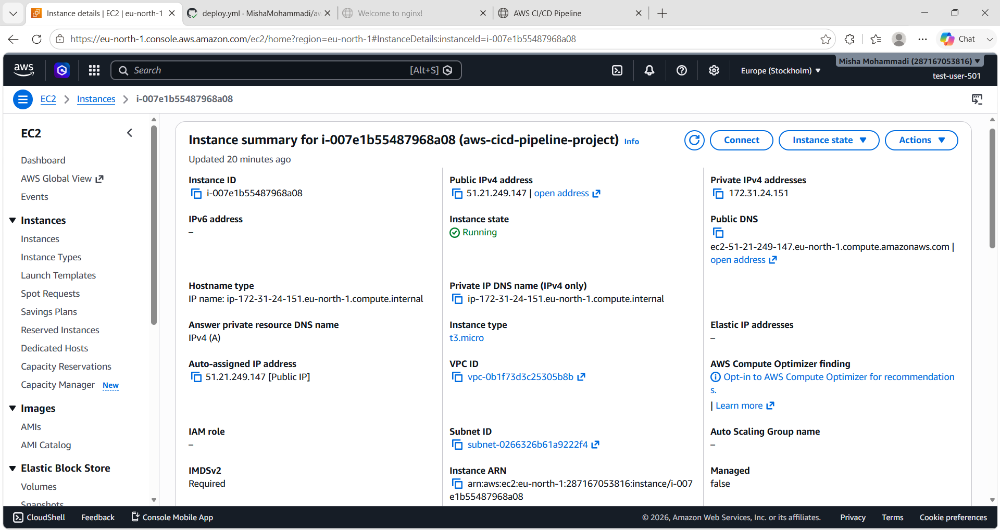
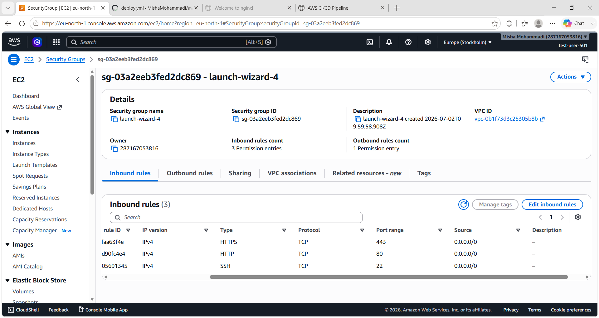
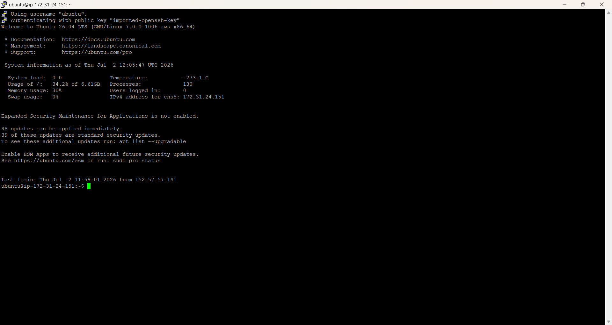
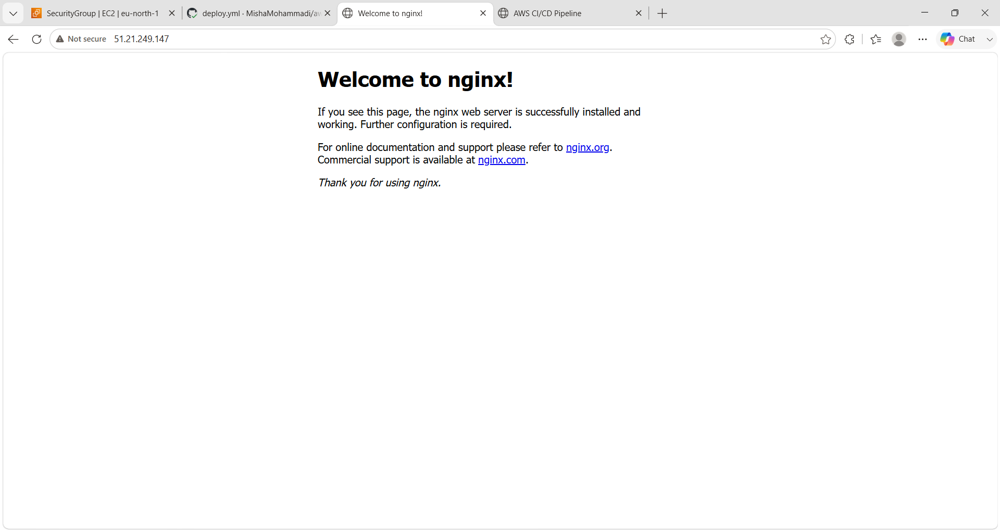
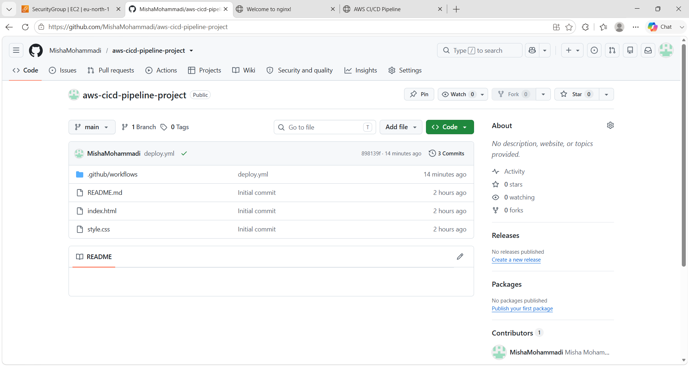
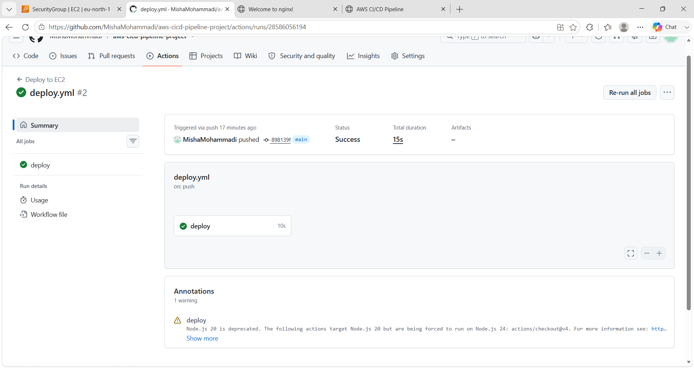
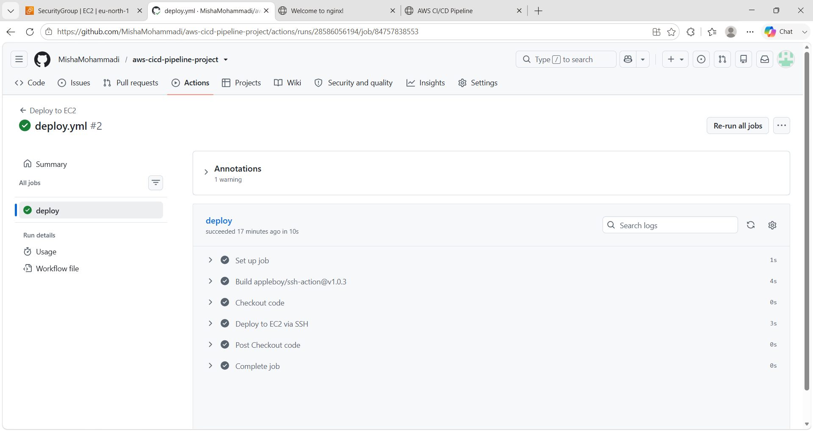
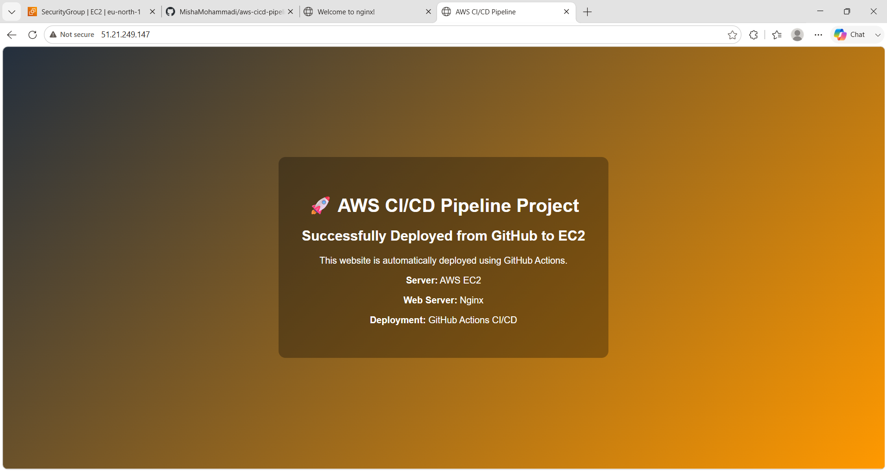

# 🚀 CI/CD Pipeline using GitHub Actions & AWS EC2

## 📌 Project Overview
This project demonstrates a complete CI/CD pipeline that automatically deploys a static website from GitHub to an AWS EC2 instance using GitHub Actions.

---

## ⚙️ Tech Stack
- AWS EC2 (Ubuntu)
- Nginx Web Server
- Git & GitHub
- GitHub Actions (CI/CD)
- SSH for deployment

---

## 🏗️ Architecture

```
Developer → GitHub → GitHub Actions → EC2 Server → Nginx → Live Website
```

---

## 🚀 Features
- Automated deployment on every Git push
- SSH-based secure deployment
- Static website hosting on EC2
- Nginx configuration for web serving
- Fully automated CI/CD pipeline

---

## 📂 Project Structure

```
aws-cicd-pipeline-project/
│
├── index.html
├── style.css
├── README.md
└── .github/workflows/deploy.yml
```

---

## 📸 Screenshots

### 1. EC2 Instance Running


---

### 2. Security Group Rules


---

### 3. SSH Connection (PuTTY)


---

### 4. Nginx Running Status


---

### 5. Default Nginx Page


---

### 6. GitHub Repository Files


---

### 7. GitHub Actions Success


---

### 8. GitHub Actions Deployment Logs


---

### 9. Live Deployed Website


---

## 🌐 Live URL

http://51.21.249.147

---

## 🔐 CI/CD Workflow

1. Developer pushes code to GitHub  
2. GitHub Actions triggers pipeline  
3. SSH connects to EC2 instance  
4. Files copied to Nginx directory  
5. Website automatically updated  

---

## 👨‍💻 Author
Misha Mohammadi